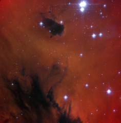

# Preview of potw1115a: "Arcade adventure for young stars"
[https://www.spacetelescope.org/images/potw1115a/](https://www.spacetelescope.org/images/potw1115a/)

Astronomers have used the NASA/ESA Hubble Space Telescope to study the young open star cluster IC 1590, which is found within the star formation region NGC 281 — nicknamed the Pacman Nebula due to its resemblance to the famous arcade game character. This image only shows the central part of the nebula, where the brightest stars at the core of the cluster are found, with part of the Pacman’s hungry mouth visible as the dark region below. But Pacman isn’t gobbling up these stars. Instead, the nebula’s gas and dust are being used as raw ingredients to make new stars. However, the stars in IC 1590 are still plotting their escape from the Pacman Nebula, as open clusters are only loosely bound together and the grouping will eventually disperse within a few tens of millions of years. IC 1590 lies about ten thousand light-years from Earth in the constellation of Cassiopeia (The Queen). Through small telescopes the core of the cluster that appears at the top of this picture shows up as a triple star, but the nebula that surrounds it is much fainter and very hard to see. The eagle-eyed American astronomer E. E. Barnard, using a 15 cm telescope, first recorded it in the late nineteenth century. This picture was created from images taken using the Wide Field Channel of Hubble’s Advanced Camera for Surveys. Images though yellow (F550M, coloured blue), orange (F660N, coloured green) and red (F658N) filters were combined. The F658N filter isolates light from glowing hydrogen gas. The total exposure times per filter were 450 s, 1017 s and 678 s, respectively and the field of view is about 3.3 arcminutes across.