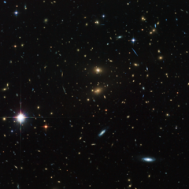

# Preview of potw1116a: "Hubble peers through the looking glass"
[https://www.spacetelescope.org/images/potw1116a/](https://www.spacetelescope.org/images/potw1116a/)

The NASA/ESA Hubble Space Telescope usually works as a solo artist to capture awe-inspiring images of the distant Universe. For this picture, though, Hubble had a helping hand from the subject of the image, a galaxy cluster called LCDCS-0829, as the huge mass of the galaxies in the cluster acted like a giant magnifying glass. This strange effect is called gravitational lensing. The object was discovered during the Las Campanas Distant Clusters Survey, which explains the cluster's unusual name. This survey was carried out in March 1995 using a 1-metre telescope at the Las Campanas Observatory in Chile. More than one thousand clusters of galaxies, most of them previously unknown, were found in a dedicated survey of a long, but narrow, section of the southern sky. The bizarre phenomenon of gravitational lensing is a consequence of Albert Einstein’s general theory of relativity, which says that the huge mass of the galaxy cluster bends the fabric of the Universe, and the light from one of the distant galaxies will then travel along this bend in the fabric. In addition to making some objects appear bigger and brighter, gravitational lensing can produce multiple images of distant galaxies and stretch them into strange arcs. Many such arcs can be seen in this image. This deep image of the cluster was created from a total of 36 exposures taken using the Wide Field Channel of Hubble’s Advanced Camera for Surveys. Images through a blue filter (F475W) were coloured blue, images through a near-infrared filter (F814W) were coloured green and images through a filter that passes infrared light of even longer wavelengths (F850LP) were coloured red. The total exposure times were 5280 s per filter and the field of view is about 2.8 arcminutes across.