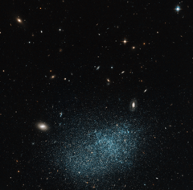

# Preview of potw1117a: "Dwarf galaxy: small but perfectly formed"
[https://www.spacetelescope.org/images/potw1117a/](https://www.spacetelescope.org/images/potw1117a/)

Galaxies come in all sorts of shapes and sizes, with most being classed as either elliptical or spiral. However, some fall into the miscellaneous category known as irregulars, such as UGC 9128 shown here in this NASA/ESA Hubble Space Telescope image. UGC 9128 is a dwarf irregular galaxy, which means that in addition to not having a well-defined shape, it probably contains only around one hundred million stars — far fewer than are found in a large spiral such as the Milky Way. Dwarf galaxies are important in understanding how the Universe has evolved and they are often referred to as galactic building blocks, as galaxies are thought to grow as smaller ones merge. In recent years, astronomers have been trying to find out if dwarf galaxies contain a similar halo and disc structure to their much larger counterparts, whereby older stars are found in the extended spheroidal halo, with the flat disc being home to younger stars. Observations of UGC 9128 indicate that it does indeed contain a similar halo and disc structure. UGC 9128 lies about 8 million light-years away, which means that it is part of the Local Group of more than 30 nearby galaxies, and it is found in the constellation of Boötes (The Herdsman). Despite its relative closeness it is very faint and was only discovered in the twentieth century. The Hubble image clearly resolves the galaxy’s starry population and also shows many much more distant galaxies in the background. This picture was created from images taken with the Wide Field Channel of Hubble’s Advanced Camera for Surveys. Images through a yellow-orange filter (F606W, coloured blue) were combined with images taken in the near-infrared (F814W, coloured red). The total exposure times were 985 s and 1174 s respectively and the field of view is 3.2 arcminutes across.