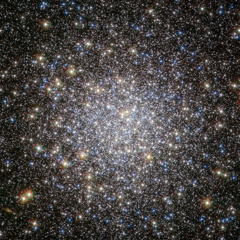

# Preview of potw1118a: "Breathing new life into an old cluster"
[https://www.spacetelescope.org/images/potw1118a/](https://www.spacetelescope.org/images/potw1118a/)

The globular cluster Messier 5, shown here in this NASA/ESA Hubble Space Telescope image, is one of the oldest belonging to the Milky Way. The majority of its stars formed more than 12 billion years ago, but there are some unexpected newcomers on the scene, adding some vitality to this aging population. Stars in globular clusters form in the same stellar nursery and grow old together. The most massive stars age quickly, exhausting their fuel supply in less than a million years, and end their lives in spectacular supernovae explosions. This process should have left the ancient cluster Messier 5 with only old, low-mass stars, which, as they have aged and cooled, have become red giants, while the oldest stars have evolved even further into blue horizontal branch stars. Yet astronomers have spotted many young, blue stars in this cluster, hiding amongst the much more luminous ancient stars. Astronomers think that these laggard youngsters, called blue stragglers, were created either by stellar collisions or by the transfer of mass between binary stars. Such events are easy to imagine in densely populated globular clusters, in which up to a few million stars are tightly packed together. Messier 5 lies at a distance of about 25 000 light-years in the constellation of Serpens (The Snake). This image was taken with Wide Field Channel of Hubble’s Advanced Camera for Surveys. The picture was created from images taken through a blue filter (F435W, coloured blue), a red filter (F625W, coloured green) and a near-infrared filter (F814W, coloured red). The total exposure times per filter were 750 s, 400 s and 567 s, respectively. The field of view is about 2.6 arcminutes across.