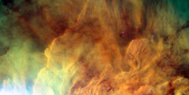

# Preview of potw1120a: "The metamorphosis of Messier 8"
[https://www.spacetelescope.org/images/potw1120a/](https://www.spacetelescope.org/images/potw1120a/)

Like a Dali masterpiece, this image of Messier 8 from the NASA/ESA Hubble Space Telescope is both intensely colourful and distinctly surreal. Located in the constellation of Sagittarius (The Archer), this giant cloud of glowing interstellar gas is a stellar nursery that is also known as the Lagoon Nebula. Although the name definitely suits the beauty of this object, “lagoon” does suggest tranquillity and there is nothing placid about the high-energy radiation causing these intricate clouds to glow. The massive stars hiding within the heart of the nebula give off enormous amounts of ultraviolet radiation, ionising the gas and causing it to shine colourfully, as well as sculpting the surrounding nebula into strange shapes. The result is an object around four to five thousand light-years away which, on a clear night, is faintly visible to the naked eye. Since it was first recorded back in the 1747 this object has been photographed and analysed at many different wavelengths. By using infrared detectors it is possible to delve into the centre of these dusty regions to study the objects within. However, while this optical image, taken with the Advanced Camera for Surveys (ACS) on the Hubble Space Telescope, cannot pierce the obscuring matter it is undoubtedly one of the most visually impressive. Messier 8 is an enormous structure — around 140 by 60 light-years in extent — to put this in perspective the orbit of Neptune stretches only about four light-hours from our own Sun. This image depicts a small region in the centre of the nebula, while the region adjacent to the Lagoon Nebula, from the same Hubble observations, can be seen here. This picture was created from exposures taken with the Wide Field Channel of the Advanced Camera for Surveys on Hubble. Light from glowing hydrogen (through the F658N filter) is coloured red. Light from ionised nitrogen (through the F660N filter) is coloured green and light through a yellow filter (F550M) is coloured blue. The exposure times through each filter are 1560 s, 1600 s and 400 s respectively. The blue-white flare at the lower left of the image is scattered light from a bright star just outside the field of view. The field of view is about 3.3 by 1.7 arcminutes.