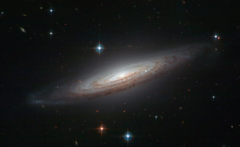

# Preview of potw1122a: "A perfect spiral with an explosive secret"
[https://www.spacetelescope.org/images/potw1122a/](https://www.spacetelescope.org/images/potw1122a/)

The NASA/ESA Hubble Space Telescope is renowned for its breathtaking images and this snapshot of NGC 634 is definitely that — the fine detail and exceptionally perfect spiral structure of the galaxy make it hard to believe that this is a real observation and not an artist’s impression or a screenshot taken straight from Star Wars. This spiral galaxy was discovered back in the nineteenth century by French astronomer Édouard Jean-Marie Stephan, but in 2008 it became a prime target for observations thanks to the violent demise of a white dwarf star. The type Ia supernova known as SN2008a was spotted in the galaxy and briefly rivalled the brilliance of its entire host galaxy but, despite the energy of the explosion, it can no longer be seen this Hubble image, which was taken around a year and a half later. White dwarfs are thought to be the endpoint of evolution for stars between 0.07 to 8 solar masses, which equates to 97% of the stars in the Milky Way. However, there are exceptions to the rule; in a binary system it is possible for a white dwarf to accrete material from the companion star and gradually put on weight. Like a person gorging on junk food, the star can eventually grow too full — when it exceeds 1.38 solar masses nuclear reactions ignite that produce enormous amounts of energy and the star explodes as a type Ia supernova.  This picture was created from images taken with the Wide Field Channel of Hubble’s Advanced Camera for Surveys. Images through a yellow filter (F555W, coloured blue) have been combined with images through red (F625W, coloured green) and near-infrared (F775W, coloured red) filters. The total exposure times per filter were 3750 s, 3530 s and 2484 s, respectively and the field of view is 2.5 x 1.5 arcminutes.