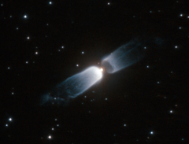

# Preview of potw1123a: "Hubble watches a celestial prologue"
[https://www.spacetelescope.org/images/potw1123a/](https://www.spacetelescope.org/images/potw1123a/)

The two billowing structures in this NASA/ESA Hubble Space Telescope image of IRAS 13208-6020 are formed from material that is shed by a central star. This is a relatively short-lived phenomenon that gives astronomers an opportunity to watch the early stages of planetary nebula formation, hence the name protoplanetary, or preplanetary nebula. Planetary nebulae are unrelated to planets and the name arose because of the visual similarity between some planetary nebulae and the small discs of the outer planets in the Solar System when viewed through early telescopes. This object has a very clear bipolar form, with two very similar outflows of material in opposite directions and a dusty ring around the star. Protoplanetary nebulae do not shine, but are illuminated by light from the central star that is reflected back to us. But as the star continues to evolve, it becomes hot enough to emit strong ultraviolet radiation that can ionise the surrounding gas, making it glow as a spectacular planetary nebula. But before the nebula begins to shine, fierce winds of material ejected from the star will continue to shape the surrounding gas into intricate patterns that can only be truly appreciated later once the nebula begins to glow. This picture was created from images taken using the High Resolution Channel of Hubble’s Advanced Camera for Surveys. Images taken through an orange filter (F606W, coloured blue) and a near-infrared filter (F814W, coloured red) have been combined to create this picture. The exposure times were 1130 s and 150 s respectively and the field of view is just 22 x 17 arcseconds.