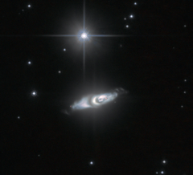

# Preview of potw1124a: "The very curious creation of an ageing star"
[https://www.spacetelescope.org/images/potw1124a/](https://www.spacetelescope.org/images/potw1124a/)

The NASA/ESA Hubble Space Telescope has made a rare celestial catch. Close to a bright, nearby star in this image, the bizarre, whorl-shaped object known as IRAS 22036+5306 has been captured during a brief tumultuous period late in a star's life.  Inside IRAS 22036+5306 lies an aged star that has coughed off almost all of its outer material, forming a cloud in space. Hidden under this veil, the dense, still-burning, exposed core of the star grows hotter. Encircling the star is a torus consisting partly of castoff material, as well as possibly the grainy remnants of comets and other small, rocky bodies. Twin jets spout from the star’s poles and pierce this dusty waist. The jets contain gobbets of material — typically about ten thousand times the mass of the Earth — hurling outwards at a speed of nearly 800 000 kilometres per hour.  IRAS 22036+5306 is making the transition through the protoplanetary, or preplanetary, nebula phase. Only a few hundred such nebulae have been spotted in our galaxy. For now, light from the central star is merely being reflected off its expelled gaseous shell. Soon, however, the star will become a very hot, white dwarf, and its intense ultraviolet radiation will ionise the blown-off gas, making it glow in rich colours. IRAS 22036+5306 will have then blossomed into a fully-fledged planetary nebula, and this event will serve as a last hurrah before the star starts its very slow final cool-down.  Planetary nebulae are much longer-lived than their precursors, protoplanetary nebulae, and are therefore more commonly spotted. The term planetary nebula is a leftover from observations through small telescopes made by early astronomers to whom some of these objects looked circular and similar in appearance to the outer planets Uranus and Neptune.  IRAS 22036+5306 is found about 6500 light-years away in the constellation of Cepheus (The King). Studying rarities such as IRAS 22036+5306 provides astronomers with a window into the short and poorly understood phase of stellar evolution when bloated red giant stars pare down to small white dwarfs. For example, mysteries remain about how exactly the dusty torus and jets form. The planetary nebula phase is thought to be the fate that awaits most medium-sized stars, including our Sun. But it is not clear that our star will make such a fuss on its way out — the star that generated all the gaseous splendour of IRAS 22036+5306 is reckoned to have been at least four times the mass of the Sun.  The image was obtained with the High Resolution Channel of Hubble’s Advanced Camera for Surveys. The picture has been made from images through a yellow/orange filter (F606W, coloured blue), a near-infrared filter (F814W, coloured orange) and a filter that lets through the red glow of hydrogen (F658N, coloured red). The total exposure times per filter were 1600 s, 3200 s and 5104 s, respectively and the field of view is about 22 arcseconds across.