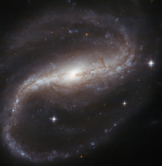

# Preview of potw1125a: "Spiral spins both ways"
[https://www.spacetelescope.org/images/potw1125a/](https://www.spacetelescope.org/images/potw1125a/)

In this NASA/ESA Hubble Space Telescope image of NGC 7479 — created from observations at visible and near-infrared wavelengths — the tightly wound arms of the spiral galaxy create an inverted ‘S’, as they spin in an anticlockwise direction. However, at radio wavelengths, this galaxy, sometimes nicknamed the Propeller Galaxy, spins the other way, with a jet of radiation that bends in the opposite direction to the stars and dust in the arms of the galaxy. Astronomers think that the radio jet in NGC 7479 was put into its bizarre backwards spin following a merger with another galaxy. Star formation is reignited by galactic collisions, and indeed NGC 7479 is undergoing starburst activity, with many bright, young stars visible in the spiral arms and disc. The three brightest stars in this image, however, are foreground stars — caught on camera because they lie between the galaxy and Hubble. This striking galaxy is easily visible in moderate telescopes as an elongated fuzzy patch of light. The spiral arms can be seen with more difficulty in larger telescopes under dark conditions. This picture was created from images taken with the Wide Field Channel of Hubble’s Advanced Camera for Surveys. Images through a yellow filter (F555W, coloured blue) were combined with images taken in the near-infrared (F814W, coloured red). The total exposure times were 520 s per filter and the field of view is 2.7 arcminutes across.