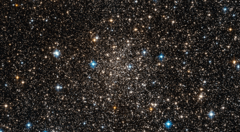

# Preview of potw1126a: "Engulfed by stars near the Milky Way’s heart"
[https://www.spacetelescope.org/images/potw1126a/](https://www.spacetelescope.org/images/potw1126a/)

The NASA/ESA Hubble Space Telescope has imaged an area so jam-packed with stars that they almost overwhelm the inky blackness of space. This includes the globular star cluster Djorgovski 1, which was only discovered in 1987 Djorgovski 1 is located close to the centre of our Milky Way Galaxy, within the bulge. If the galaxy is thought of as being like a city, then this bulge is the very busiest district at its centre. Djorgovski 1's proximity to this hub — within just a few degrees — explains why the picture is teeming with stars. Globular clusters like Djorgovski 1 formed early in the Milky Way's history, and as such may hold clues about the inner galaxy’s early evolution. However, with so much material in the way, obtaining accurate data is problematic. To make matters worse, these stars are faint. Even the most luminous stars in Djorgovski 1 are fainter than the brightest giant stars in the bulge. Another quandary is apparent: how do you know which stars belong to Djorgovski 1, and which are from the bulge? To determine this, astronomers have studied the chemical composition of numerous stars in the area. Stars with a similar composition likely belong in the same group, like siblings in a family. This technique has successfully provided the information to distinguish between stars in Djorgovski 1 and the surrounding bulge. These studies also reveal that Djorgovski 1’s stars contain hydrogen and helium, but not much else. In astronomical terms, they are described as “metal-poor”. In fact, it appears that Djorgovski 1 is one of the most metal-poor clusters in the inner galaxy. It is not clear why this is the case, but additional research may shed light on the issue. This picture was created from multiple images taken with the Wide Field Camera of Hubble’s Advanced Camera for Surveys. Exposures through a yellow/orange filter (F606W) are coloured blue and images through a near-infrared filter (F814W) are shown as red. The total exposure times per filter are 340 s and 360 s, respectively, and the field of view is 2.7 by 1.5 arcminutes in extent.