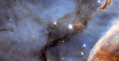

# Preview of potw1127a: "Return to the Carina Nebula"
[https://www.spacetelescope.org/images/potw1127a/](https://www.spacetelescope.org/images/potw1127a/)

Looking like an elegant abstract art piece painted by talented hands, this picture is actually a NASA/ESA Hubble Space Telescope image of a small section of the Carina Nebula. Part of this huge nebula was documented in the well-known Mystic Mountain picture (heic1007a) and this picture takes an even closer look at another piece of this bizarre astronomical landscape (heic0707a). The Carina Nebula itself is a star-forming region about 7500 light-years from Earth in the southern constellation of Carina (The Keel: part of Jason’s ship the Argo). Infant stars blaze with a ferocity so severe that the radiation emitted carves away at the surrounding gas, sculpting it into strange structures. The dust clumps towards the upper right of the image, looking like ink dropped into milk, were formed in this way. It has been suggested that they are cocoons for newly forming stars. The Carina Nebula is mostly made from hydrogen, but there are other elements present, such as oxygen and sulphur. This provides evidence that the nebula is at least partly formed from the remnants of earlier generations of stars where most elements heavier than helium were synthesised. The brightest stars in the image are not actually part of the Carina Nebula. They are much closer to us, essentially being the foreground to the Carina Nebula’s background. This picture was created from images taken with Hubble’s Wide Field Planetary Camera 2. Images through a blue filter (F450W) were coloured blue and images through a yellow/orange filter (F606W) were coloured red. The field of view is 2.4 by 1.3 arcminutes.