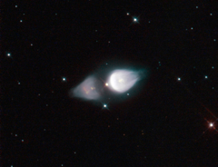

# Preview of potw1128a: "Rare cosmic footprint"
[https://www.spacetelescope.org/images/potw1128a/](https://www.spacetelescope.org/images/potw1128a/)

The NASA/ESA Hubble Space Telescope has been used to capture a striking image of a rare astronomical phenomenon called a protoplanetary nebula. This particular example, called Minkowski’s Footprint, also known as Minkowski 92, features two vast onion-shaped structures either side of an ageing star, giving it a very distinctive shape. Protoplanetary nebulae like Minkowski’s Footprint have short lives, being a preliminary stage to the more common planetary nebula phase. In the middle of the image is a star, soon to be a white dwarf, puffing out material due to intense surface pulsations. Charged particle streams, called stellar winds, are shaping this gas into the interesting shapes that Hubble allows us to see. Technically speaking Minkowski’s Footprint is currently a reflection nebula as it is only visible due to the light reflected from the central star. In a few thousand years the star will get hotter and its ultraviolet radiation will light up the surrounding gas from within, causing it to glow. At this point it will have become a fully fledged planetary nebula. The processes behind protoplanetary nebulae are not completely understood, making observations such as this even more important. Hubble has already conducted sterling work in this field, and is set to continue. The image was obtained with the Hubble's Wide Field Planetary Camera 2. The picture has been made from many exposures through four different colour filters. Light from ionised oxygen has been coloured blue (F502N), light passing through a green/yellow filter (F547M) is coloured cyan, light from atomic oxygen is coloured yellow (F631N) and light from ionised sulphur is coloured red (F673N). The total exposure times per filter were 2080 s, 960 s, 2080 s and 1980 s respectively and the field of view is only about 36 arcseconds across.