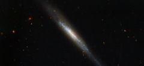

# Preview of potw1129a: "Edge-on galaxy hosts supernova explosion"
[https://esahubble.org/images/potw1129a/](https://esahubble.org/images/potw1129a/)

The NASA/ESA Hubble Space Telescope has imaged an elongated stream of stars, gas and dust called IC 755, which is actually a spiral galaxy that we are seeing edge-on. In 1999 a star within IC 755 was seen to explode as a supernova and named SN 1999an. The supernova was discovered by the Beijing Astronomical Observatory Supernova Survey and three years later Hubble was used to study the environment in which the explosion took place. The inclination of the galaxy made the supernova a challenging target as many other intervening objects obscured the view. Valuable data were obtained and suggest that before detonation the star may have been around 20 times more massive than our Sun, and that it was likely to have been in the region of 14 million years old. Supernovae like SN 1999an are classified as Type IIs and they are dramatic events that mark the end of the lives of massive stars. They have an important role to play in galaxy evolution as many elements are formed during the explosion and are ejected with such force that they are distributed far and wide. Shockwaves also help to mix material within the host galaxy and may spark new rounds of star formation. Billions of stars make up galaxies like IC 755 and many will become supernovae, using their final moments to breathe new life into the rest of the Universe. This picture was created from multiple images taken with the Wide Field Camera of Hubble’s Advanced Camera for Surveys. Exposures through a blue filter (F435W) are coloured blue, exposures through a yellow-green filter (F555W) are coloured green and images through a near-infrared filter (F814W) are shown as red. The total exposure times per filter are 430 s and the field of view is 3.3 x 1.5 arcminutes.