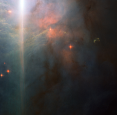

# Preview of potw1130a: "Sunset glow in Orion"
[https://www.spacetelescope.org/images/potw1130a/](https://www.spacetelescope.org/images/potw1130a/)

NGC 2023 surrounds a massive young B-type star. These stars are large, bright and blue-white in colour, and have a high surface temperature, being several times hotter than the Sun. The energy emitted from NGC2023’s B-type star illuminates the nebula, resulting in its high surface brightness: good news for astronomers who wish to study it. The star itself lies outside the field of view, at the upper left, and its brilliant light is scattered by Hubble’s optical system, creating the bright flare across the left side of the picture, which is not a real feature of the nebula. Stars are forming from the material comprising NGC 2023. This Hubble image captures the billowing waves of gas, 5000 times denser than the interstellar medium. The unusual greenish clumps are thought to be Herbig–Haro objects. These peculiar features of star-forming regions are created when gas ejected at hundreds of kilometres per second from newly formed stars impacts the surrounding material. These shockwaves cause the gas to glow and result in the strange shapes seen here. Herbig–Haro objects typically only last for a few thousand years, which is the blink of eye in astronomical terms. This picture was created from multiple images taken with the Wide Field Camera of Hubble’s Advanced Camera for Surveys. Exposures through a blue filter (F475W) are coloured blue, exposures through a yellow filter (F625W) are coloured green and images through a near-infrared filter (F850LP) are shown as red. The total exposure times per filter are 800 s, 800 s and 1200 s, respectively, and the field of view spans 3.2 arcminutes. 