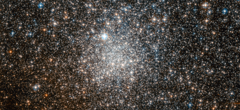

# Preview of potw1131a: "Enigmatic cluster targeted by Hubble"
[https://www.spacetelescope.org/images/potw1131a/](https://www.spacetelescope.org/images/potw1131a/)

The NASA/ESA Hubble Space Telescope has used its powerful optics to separate the globular cluster NGC 6401 into its constituent stars. What was once only visible as a ghostly mist in the eyepieces of astronomical instruments has been transformed into a stunning stellar landscape. NGC 6401 can be found within the constellation of Ophiuchus (The Serpent Bearer). The globular cluster itself is relatively faint, so a telescope and some observational experience are required to see it. Globular clusters are very rich, and generally spherical, collections of stars, hence the name. They orbit the cores of galaxies, with the force of gravity also keeping the stars bound as a group. There are around 160 globular clusters associated with our Milky Way, of which NGC 6401 is one. These objects are very old, containing some of the most ancient stars known. However, there are many mysteries surrounding them, with the origin of globular clusters and their role within galaxy evolution not being completely understood. The famous astronomer William Herschel discovered this cluster in 1784 with his 47 cm telescope, but mistakenly believed it to be a bright nebula. Later his son, John Herschel, was to make the same error — evidently the technology of the day was insufficient to allow the individual stars to be resolved visually. NGC 6401 has confused more modern astronomers as well. In 1977 it was thought that a low-mass star in the cluster had been discovered venting its outer layers (known as a planetary nebula). However, a further study in 1990 concluded that the object is in fact a symbiotic star: a binary composed of a red giant and a small hot star such as a white dwarf, with surrounding nebulosity. It could be that the study in 1977 was simply a few thousand years ahead of its time, as symbiotic stars are thought to become a type of planetary nebula. This picture was created from images taken with the Wide Field Channel of Hubble’s Advanced Camera for Surveys. Images through a yellow-orange filter (F606W, coloured blue) were combined with images taken in the near-infrared (F814W, coloured red). The total exposure times were 680 s and 580 s, respectively and the field of view is 3.3 x 1.5 arcminutes.