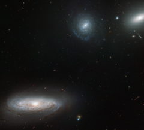

# Preview of potw1132a: "Crowded, but suspiciously quiet?"
[https://www.spacetelescope.org/images/potw1132a/](https://www.spacetelescope.org/images/potw1132a/)

The NASA/ESA Hubble Space Telescope has imaged part of the Hickson Compact Group 7, or HCG 7 for short. This grouping is composed of one lenticular (lens-shaped) and three spiral galaxies in close proximity. In this image, one of the spirals dominates the foreground, with many more distant galaxies peppering the background. Observing tightly-knit galaxy groups like HCG 7 is important because they evolve in a different way from their more spaced-out counterparts in less crowded regions of the Universe.  A recent study using Hubble data analysed the star clusters in HCG 7. Three hundred young clusters and 150 globular clusters were charted, and their ages and distributions measured. The results suggest that the rate of star formation has been fairly steady through time, although quite high in the central regions. Additional studies, including searches for material between the galaxies, hint that the stars in the HCG 7 galaxies formed by converting their gas without any gravitational influences caused by merging with other galaxies. This is puzzling, as the galaxies are depleting their supplies of gas at a rate that suggests that they have merged in the past.  This raises the question of whether the group really has evolved serenely, or if there are mysterious processes at work that are yet to be understood. The currently known information is contradictory and an encouragement for further studies to discover the real story behind HCG 7. This picture was created from images taken with the Wide Field Channel of the Advanced Camera for Surveys. Images through a blue filter (F435W, coloured blue), yellow-orange (F606W, coloured green) and near-infrared (F814W, coloured red) filters were combined. The total exposure times were 1710 s, 1230 s and 1065 s per filter, respectively, and the field of view is 3.3 x 3.0 arcminutes. A paper from the Astrophysical Journal discussing these recent discoveries about HCG 7 can be read here.  