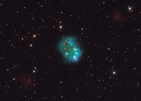

# Preview of potw1133a: "Hubble offers a dazzling necklace"
[https://esahubble.org/images/potw1133a/](https://esahubble.org/images/potw1133a/)

A giant cosmic necklace glows brightly in this NASA/ESA Hubble Space Telescope image.The  object, aptly named the Necklace Nebula, is a recently discovered  planetary nebula, the glowing remains of an ordinary, Sun-like star. The  nebula consists of a bright ring, measuring about two light-years  across, dotted with dense, bright knots of gas that resemble diamonds in  a necklace. The knots glow brightly due to absorption of ultraviolet  light from the central stars.A  pair of tightly orbiting stars produced the nebula, also called PN  G054.2-03.4. About 10 000 years ago one of the aging stars ballooned to  the point where it engulfed its companion star. The smaller star  continued orbiting inside its larger companion, increasing the giant’s  rotation rate, so that the bloated star span so fast that a large part  of its gaseous envelope expanded into space. Most of the gas escaped  along the star’s equator, producing a ring. The bright knots are dense  gas clumps in the ring.The  pair is so close, only a few million kilometres apart, that they appear  as one bright dot in the centre of this image. The stars are furiously  whirling around each other, completing an orbit in a little more than a  day. For comparison, Mercury, the innermost planet of our Solar System,  orbits the Sun in 88 days.The  Necklace Nebula is located 15 000 light-years away in the constellation  of Sagitta (The Arrow). In this composite image, taken on 2 July,  Hubble’s Wide Field Camera 3 captured the glow of hydrogen (blue),  oxygen (green), and nitrogen (red).