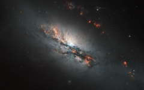

# Preview of potw1134a: "Feeling the strain"
[https://www.spacetelescope.org/images/potw1134a/](https://www.spacetelescope.org/images/potw1134a/)

NGC 2146 is classified as a barred spiral due to its shape, but the most distinctive feature is the dusty spiral arm that has looped in front of the galaxy's core as seen from our perspective. The forces required to pull this structure out of its natural shape and twist it up to 45 degrees are colossal. The most likely explanation is that a neighbouring galaxy is gravitationally perturbing it and distorting the orbits of many of NGC 2146’s stars. It is probable that we are currently witnessing the end stages of a process which has been occurring for tens of millions of years. NCG 2146 is undergoing intense bouts of star formation, to such an extent that it is referred to as a starburst galaxy. This is a common state for barred spirals, but the extra gravitational disruption that NGC 2146 is enduring no doubt exacerbates the situation, compressing hydrogen-rich nebulae and triggering stellar birth. Measuring about 80 000 light-years from end to end, NGC 2146 is slightly smaller than the Milky Way. It lies approximately 70 million light-years distant in the faint northern constellation of Camelopardalis (The Giraffe). Although it is fairly easy to see with a moderate-sized telescope as a faint elongated blur of light it was not spotted until 1876 when the German astronomer Friedrich Winnecke found it visually using just a 16 cm telescope. This picture was created from images taken with the Wide Field Channel of Hubble’s Advanced Camera for Surveys. Images through a near-infrared filter (F814W, coloured blue and orange/brown) were combined with images taken in a filter that isolates the glow from hydrogen gas (F658N, coloured red). An additional green colour channel was also created by combining the two to help to create a realistic colour rendition for the final picture from this unusual filter combination. The total exposure times were 120 s and 700 s respectively and the field of view is covers 2.6 x 1.6 arcminutes.