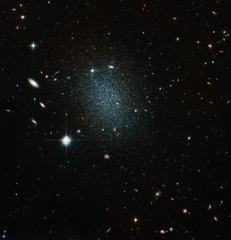

# Preview of potw1135a: "Astronomical vision test"
[https://www.spacetelescope.org/images/potw1135a/](https://www.spacetelescope.org/images/potw1135a/)

Peering into the depths of space, the sharp-eyed NASA/ESA Hubble Space Telescope has imaged the nearby but faint dwarf galaxy ESO 540-030. This object itself appears as a huge swarm of dim stars, but ESO 540-030 is actually just one point of interest in the picture. ESO 540-030 is just over 11 million light-years distant, and is part of the Sculptor group of galaxies. This collection is the closest neighbour to our own Local Group of galaxies that includes the Milky Way. Due to its proximity the Sculptor group contains some of the brightest galaxies in the southern skies, although ESO 540-030 is not one of these; dwarf galaxies generally have low surface brightness, which make observations difficult. Hubble has captured a snapshot of galaxy types in the background, with spirals, barred spirals, ellipticals and irregulars on display. Careful examination of this picture should allow examples of each galaxy type to be found. Some galaxies lie directly behind ESO 540-030, increasing the challenge. As well as the galaxies there are also five bright stars, which are much closer to us than the galaxies. The telltale diffraction spikes — four sharp lines of light emanating at 90 degree angles, caused by light diffracting in the telescope — are unmistakable signs of the stars in the picture. Cataloguing galaxy types is an important task for scientists attempting to understand more about how our Universe evolved. Our own eyes are excellent tools for this, as participants of the Galaxy Zoo Hubble project will confirm [1]. This picture was created from images taken with the Wide Field Channel of Hubble’s Advanced Camera for Surveys. Images through a yellow-orange filter (F606W, coloured blue) were combined with images taken in the near-infrared (F814W, coloured red). The total exposure times were 4480 s and 3360 s, respectively and the field of view is about 3.1 arcminutes across. Links [1] http://www.galaxyzoo.org/