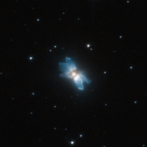

# Preview of potw1136a: "A starfish in the sky"
[https://www.spacetelescope.org/images/potw1136a/](https://www.spacetelescope.org/images/potw1136a/)

Protoplanetary nebulae offer glimpses of how stars similar to the Sun end their lives and how they make the transition to white dwarfs surrounded by planetary nebulae. As it ages, a Sun-like star eventually sheds its outer layers into space, creating a beautiful and often intricately shaped cloud of gas and dust around it. At first, still relatively cool, the star is unable to ionise this gas, which shines only by reflected and scattered stellar light. Only when the temperature of the star increases enough to ionise this protoplanetary nebula does the pattern of gas and dust become a fully fledged planetary nebula. Protoplanetary nebulae are relatively rare and short-lived objects that provide astronomers with clues into how the often strangely asymmetric planetary nebulae are formed. Clearly visible in this image are five blue lobes that extend away from the central star and give the nebula its asymmetric starfish shape. While astronomers have come up with theories for the origin of these structures, such as direction-changing jets or explosive ejections of matter from the star, their formation is not entirely understood. IRAS 19024+0044 is blue in colour as the blue component of the light coming from the star is more easily scattered by the gas and dust in the nebula, while the red and orange rays are relatively unaffected. This is similar to what happens to sunlight in the Earth’s atmosphere, giving the sky its distinctive shade of blue. This picture was created from images taken with the High Resolution Channel of Hubble’s Advanced Camera for Surveys. It is a composite image created by the combination of exposures taken through a yellow–orange filter (F606W, coloured blue) and a near-infrared filter (F814W, coloured red). The total exposure times were 880 s and 140 s, respectively and the field of view is approximately 13 by 13 arcseconds. Links  Paper on IRAS 19024+0044: Sahai, R., Sánchez Contreras, C. & Morris, M. 2005, The Astrophysical Journal, 620, 948 