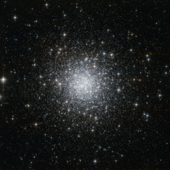

# Preview of potw1137a: "A remote outpost of the Milky Way"
[https://www.spacetelescope.org/images/potw1137a/](https://www.spacetelescope.org/images/potw1137a/)

This NASA/ESA Hubble Space Telescope image shows a compact and distant globular star cluster that lies in one of the smallest constellations in the night sky, Delphinus (The Dolphin). Due to its modest size, great distance and relatively low brightness, NGC 7006 is often ignored by amateur astronomers. But even remote globular clusters such as this one appear bright and clear when imaged by Hubble’s Advanced Camera for Surveys. NGC 7006 resides in the outskirts of the Milky Way. It is about 135 000 light-years away, five times the distance between the Sun and the centre of the galaxy, and it is part of the galactic halo. This roughly spherical region of the Milky Way is made up of dark matter, gas and sparsely distributed stellar clusters. Like other remote globular clusters, NGC 7006 provides important clues that help astronomers to understand how stars formed and assembled in the halo. The cluster now pictured by Hubble has a very eccentric orbit indicating that it may have formed independently, in a small galaxy outside our own that was then captured by the Milky Way. Although NGC 7006 is very distant for a Milky Way globular cluster, it is much closer than the many faint galaxies that can be seen in the background of this image. Each of these faint smudges is probably accompanied by many globular clusters similar to NGC 7006 that are too faint to be seen even by Hubble. This image was taken using the Wide Field Channel of the Advanced Camera for Surveys, in a combination of visible and near-infrared light. The field of view is a little over 3 by 3 arcminutes.