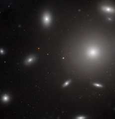

# Preview of potw1138a: "Galaxies in a swarm of star clusters"
[https://www.spacetelescope.org/images/potw1138a/](https://www.spacetelescope.org/images/potw1138a/)

In  this NASA/ESA Hubble Space Telescope image, NGC 4874 is the brightest  object, located to the right of the frame and seen as a bright star-like  core surrounded by a hazy halo. A few of the other galaxies of the  cluster are also visible, looking like flying saucers dancing around NGC  4874. But the really remarkable feature of this image is the point-like  objects around NGC 4874, revealed on a closer look: almost all of them  are clusters of stars that belong to the galaxy. Each of these globular  star clusters contains many hundreds of thousands of stars. Recently,  astronomers discovered that a few of these point-like objects are not  star clusters but ultra-compact dwarf galaxies, also under the  gravitational influence of NGC 4874. Being only about 200 light-years  across and mostly made up of old stars, these galaxies resemble brighter  and larger versions of globular clusters. They are thought to be the  cores of small elliptical galaxies that, due to the violent interactions  with other galaxies in the cluster, lost their gas and surrounding  stars. This  Hubble image also shows many more distant galaxies that do not belong  to the cluster, seen as small smudges in the background. While the  galaxies in the Coma Cluster are located about 350 million light-years  away, these other objects are much further out. Their light took several  hundred million to billions of years to reach us. Most  unusually, the image also shows a very faint blue satellite trail,  extending across the whole image, from the upper left corner of the  frame to the lower right. Because Hubble’s cameras can only see a tiny  part of the sky at one time, such trails are very rare. This  picture was created from optical and near-infrared exposures taken with  the Wide Field Channel of Hubble’s Advanced Camera for Surveys. The  field of view is 3.3 arcminutes across.