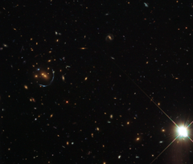

# Preview of potw1139a: "An arc sculpted by gravity"
[https://www.spacetelescope.org/images/potw1139a/](https://www.spacetelescope.org/images/potw1139a/)

This NASA/ESA Hubble Space Telescope image shows remarkable structures in a galaxy cluster around an object called LRG-4-606. LRG stands for Luminous Red Galaxy, and is the acronym given to a large collection of bright red galaxies found in the Sloan Digital Sky Survey (SDSS). These objects are mostly massive elliptical galaxies composed of huge numbers of old stars. It is sobering to contemplate the sheer number of stars that this image must contain — hundreds of billions — but it also features one of the strangest phenomena known to astronomers. This particular red galaxy and its surrounding galaxies happen to be positioned so that their strong gravitational field has a dramatic effect. Left of centre in the picture, blue galaxies in the background have been stretched and warped out of shape into narrow, pale blue arcs. This is because of an effect called gravitational lensing. The galaxy cluster has such a strong gravitational field that it is curving the fabric of space and amplifying the starlight from much more distant galaxies. Gravitational lensing normally creates elongated arcs and here, unusually, the alignment of the galaxies has made the separate arcs combine to form a half-circle. This picture was assembled from a collection of exposures in visible and near infrared light taken with Hubble’s Wide Field Camera 3. The field of view is approximately 3 by 3 arcminutes.