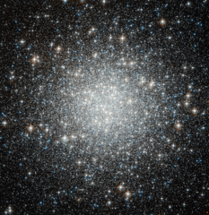

# Preview of potw1140a: "Spot the difference — Hubble spies another globular cluster, but with a secret"
[https://www.spacetelescope.org/images/potw1140a/](https://www.spacetelescope.org/images/potw1140a/)

Thousands  and thousands of brilliant stars make up this globular cluster, Messier  53, captured with crystal clarity in this image from the NASA/ESA  Hubble Space Telescope. Bound tightly by gravity, the cluster is roughly  spherical and becomes denser towards its heart. These  enormous sparkling spheres are by no means rare, and over 150 exist in  the Milky Way alone, including Messier 53. It lies on the outer edges of  the galaxy, where many other globular clusters are found, almost  equally distant from both the centre of our galaxy and the Sun. Although  they are relatively common, the famous astronomer William Herschel, not  at all known for his poetic nature, once described a globular cluster  as “one of the most beautiful objects I remember to have seen in the heavens”, and it is clear to see why. Globular  clusters are much older and larger than open clusters, meaning they are  generally expected to contain more old red stars and fewer massive blue  stars. But Messier 53 has surprised astronomers with its unusual number  of a type of star called blue stragglers. These  youngsters are rebelling against the theory of stellar evolution. All  the stars in a globular cluster are expected to form around the same  time, so they are expected follow a specific trend set by the age of the  cluster and based on their mass. But blue stragglers don’t follow that  rule; they appear to be brighter and more youthful than they have any  right to be. Although their precise nature remains mysterious these  unusual objects are probably formed by close encounters, possibly  collisions, between stars in the crowded centres of globular clusters. This  picture was put together from visible and infrared exposures taken with  the Wide Field Channel of Hubble's Advanced Camera for Surveys.The  field of view is approximately 3.4 arcminutes across.