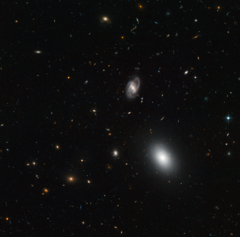

# Preview of potw1141a: "A snapshot of galactic evolution"
[https://www.spacetelescope.org/images/potw1141a/](https://www.spacetelescope.org/images/potw1141a/)

Galaxies  come in a variety of shapes and sizes, and these features change as  they evolve. Some, like the galaxy in the centre of this NASA/ESA Hubble  Space Telescope image, are beautiful spirals with graceful curved arms,  while others are fuzzy oval-shaped blobs like the large object showing  up near the bottom right of the frame. Others still are rather irregular  in shape, such as the orange galaxy at the top of the image, which  resembles a tiny wobbling string. This  picture is one of the few hundred exposures taken with Hubble’s  Advanced Camera for Surveys to assemble the “Extended Groth Strip”. This  strip, named after the Princeton University astronomer Edward Groth, is  a composite picture of a rectangular region of the sky in the  constellation of Ursa Major. It covers a relatively small area in the  sky — equivalent to roughly the width of a finger stretched at arms’  length — but includes at least 50 000 galaxies. The  images that make up the Extended Groth Strip allow astronomers to peer  into the last eight billion years of the Universe’s history and to see  galaxies at various stages of their evolution. The large elliptical and  spiral objects we see in the foreground of this image are fully-formed  adult galaxies. But many of the ones in the background, fuzzier and more  peculiar in shape, are representative of a time when galaxies were  undergoing active formation. Images  like these help astronomers to understand how galaxies change in size  and shape as they evolve, from their early formative years — punctuated  by violent events such as the growth of the vast black holes at their  centres and collisions with other galaxies — into their quieter adult  lives. This  picture was created from visible and infrared exposures taken with the  Wide Field Channel of Hubble’s Advanced Camera for Surveys