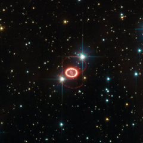

# Preview of potw1142a: "Hubble revisits an old friend"
[https://www.spacetelescope.org/images/potw1142a/](https://www.spacetelescope.org/images/potw1142a/)

Supernova SN 1987A, one of the brightest stellar explosions since the invention of the telescope more than 400 years ago, is no stranger to the NASA/ESA Hubble Space Telescope. The observatory has been on the frontline of studies into this brilliant dying star since its launch in 1990, three years after the supernova exploded on 23 February 1987. This image of Hubble’s old friend, retreived from the telescope’s data archive, may be the best ever of this object, and reminds us of the many mysteries still surrounding it. Dominating this picture are two glowing loops of stellar material and a very bright ring surrounding the dying star at the centre of the frame. Although Hubble has provided important clues on the nature of these structures, their origin is still largely unknown. Another mystery is that of the missing neutron star. The violent death of a high-mass star, such as SN 1987A, leaves behind a stellar remnant — a neutron star or a black hole. Astronomers expect to find a neutron star in the remnants of this supernova, but they have not yet been able to peer through the dense dust to confirm it is there. The supernova belongs to the Large Magellanic Cloud, a nearby galaxy about 168 000 light-years away. Even though the stellar explosion took place around 166 000 BC, its light arrived here less than 25 years ago. This picture is based on observations done with the High Resolution Channel of Hubble’s Advanced Camera for Surveys. The field of view is approximately 25 by 25 arcseconds.