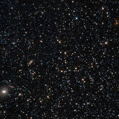

# Preview of potw1143a: "Hubble sizes up a dwarf galaxy"
[https://www.spacetelescope.org/images/potw1143a/](https://www.spacetelescope.org/images/potw1143a/)

The NASA/ESA Hubble Space Telescope has taken this image of the Phoenix Dwarf Galaxy, which is located 1.4 million light-years away from Earth. It is located in the constellation of Phoenix in the southern sky. The object, a dwarf irregular galaxy, features younger stars in its inner regions and older ones at its outskirts. Dwarf galaxies are small galaxies composed of a few billion stars, compared to fully-fledged galaxies which can contain hundreds of billions of stars. In the Local Group, there are a number of such dwarf galaxies orbiting the larger galaxies such as the Milky Way or the Andromeda Galaxy. They are thought to have been created by tidal forces in the early stages of the creation of these galaxies, or as a result of collisions between galaxies, forming from ejected streams of material and dark matter from the parent galaxies. The Milky Way galaxy features at least 14 satellite dwarf galaxies orbiting it. Because of their shape, dwarf irregulars have often been mistaken for globular clusters: they do not feature a bulge or spiral arms like larger galaxies. However, their importance in terms of cosmology is in stark contrast to their unspectacular shapes, as their chemical makeup and high levels of gas are believed to be similar to those of the earliest galaxies that populated the Universe. They are thought to be contemporary versions of some of the remote galaxies observed in deep field galaxy surveys, and can thus help to understand the early stages of galaxy and star formation in the young Universe. The galaxy was discovered in 1976 by Hans-Emil Schuster and Richard Martin West. Hans-Emil Schuster was acting director of ESO’s La Silla Observatory in Chile and was involved in the selection and testing of the sites for the observatories of both La Silla and Paranal. His great contribution to astronomy and to ESO was recognised by the Chilean government last week when he was awarded the medal of the Order of Bernardo O’Higgins.