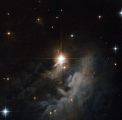

# Preview of potw1144a: "Looking to the heavens"
[https://www.spacetelescope.org/images/potw1144a/](https://www.spacetelescope.org/images/potw1144a/)

The  pearly wisps surrounding the central star IRAS 10082-5647 in this  Hubble image certainly draw the eye towards the heavens. The  divine-looking cloud is a reflection nebula, made up of gas and dust  glowing softly by the reflected light of nearby stars, in this case a  young Herbig Ae/Be star. The  star, like others of this type, is still a relative youngster, only a  few million years old. It has not yet reached the so-called main  sequence phase, where it will spend around 80% of its life creating  energy by burning hydrogen in its core. Until then the star heats itself  by gravitational collapse, as the material in the star falls in on  itself, becoming ever denser and creating immense pressure which in turn  gives off copious amounts of heat. Stars  only spend around 1% of their lives in this pre-main sequence phase.  Eventually, gravitational collapse will heat the star’s core enough for  hydrogen fusion to begin, propelling the star into the main sequence  phase, and adulthood. The  Advanced Camera for Surveys aboard the Hubble Space Telescope captured  the whorls and arcs of this nebula, lit up with the light from IRAS  10082-5647. Visible (555 nm) and near-infrared (814 nm) filters were  used, coloured blue and red respectively. The field of view is around 1.3 by 1.3 arcminutes.