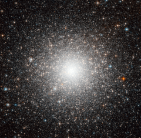

# Preview of potw1145a: "First globular cluster outside the Milky Way"
[https://www.spacetelescope.org/images/potw1145a/](https://www.spacetelescope.org/images/potw1145a/)

The object shown in this beautiful Hubble image, dubbed Messier 54, could be just another globular cluster, but this dense and faint group of stars was in fact the first globular cluster found that is outside our galaxy. Discovered by the famous astronomer Charles Messier in 1778, Messier 54 belongs to a satellite of the Milky Way called the Sagittarius Dwarf Elliptical Galaxy. Messier had no idea of the significance of his discovery at the time, and it wasn’t until over two centuries later, in 1994, that astronomers found Messier 54 to be part of the miniature galaxy and not our own. Current estimates indicate that the Sagittarius dwarf, and hence the cluster, is situated almost 90 000 light-years away — more than three times as far from the centre of our galaxy than the Solar System. Ironically, even though this globular cluster is now understood to lie outside the Milky Way, it will actually become part of it in the future. The strong gravitational pull of our galaxy is slowly engulfing the Sagittarius dwarf, which will eventually merge with the Milky Way creating one much larger galaxy. This picture is a composite created by combining images taken with the Wide Field Channel of Hubble’s Advanced Camera for Surveys. Light that passed through a yellow-orange (F606W) was coloured blue and light passing through a near-infrared filter (F814W) was coloured red. The total exposure times were 3460 s and 3560 s, respectively and the field of view is approximately 3.4 by 3.4 arcminutes.