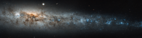

# Preview of potw1146a: "The belly of the cosmic whale"
[https://www.spacetelescope.org/images/potw1146a/](https://www.spacetelescope.org/images/potw1146a/)

The NASA/ESA Hubble Space Telescope has peered deep into NGC 4631, better known as the Whale Galaxy. Here, a profusion of starbirth lights up the galactic centre, revealing bands of dark material between us and the starburst. The galaxy’s activity tapers off  in its outer regions where there are fewer stars and less dust, but these are still punctuated by pockets of star formation. The Whale Galaxy is about 30 million light-years away from us in the constellation of Canes Venatici (The Hunting Dogs) and is a spiral galaxy much like the Milky Way. From our vantage point, however, we see the Whale Galaxy edge-on, seeing its glowing centre through dusty spiral arms. The galaxy's central bulge and asymmetric tapering disc have suggested the shape of a whale or a herring to past observers. Many supernovae — the explosions of hot, blue, short-lived stars at least eight times the mass of the Sun — have gone off in the core of the Whale Galaxy. The stellar pyrotechnics have bathed the galaxy in hot gas, visible to X-ray telescopes like ESA’s XMM–Newton. Comparing the optical and near-infrared observations from Hubble with other telescopes sensitive to different wavelengths of light helps astronomers gather the full story behind celestial phenomena. From such work, the triggers of the starburst in the Whale Galaxy and others can be elucidated. The gravitational "feeding" on intergalactic material, as well as clumping caused by the gravitational interactions with its galactic neighbours, creates the areas of greater density where stars start to coalesce. Just as blue whales, the biggest creatures on Earth, can gorge themselves on comparatively tiny bits of plankton, so the Whale Galaxy has become filled with the gas and dust that powers a high rate of star formation.