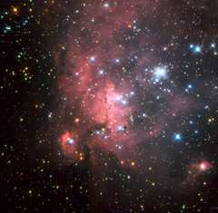

# Preview of potw1147a: "Probing a super-giant shell of gas and stars"
[https://www.spacetelescope.org/images/potw1147a/](https://www.spacetelescope.org/images/potw1147a/)

In one of the largest known star formation regions in the Large Magellanic Cloud (LMC), a small satellite galaxy of the Milky Way, lie young and bright stellar groupings known as OB associations. One of these associations, called LH 72, was captured in this dramatic NASA/ESA Hubble Space Telescope image. It consists of a few high-mass, young stars embedded in a beautiful and dense nebula of hydrogen gas. Much of the star formation in the LMC occurs in super-giant shells. These regions of interstellar gas are thought to have formed due to strong stellar winds and supernova explosions that cleared away much of the material around the stars creating wind-blown shells. The swept-up gas eventually cools down and fragments into smaller clouds that dot the edges of these regions and eventually collapse to form new stars. The biggest of these shells, home to LH 72, is designated LMC4. With a diameter of about 6000 light-years, it is the largest in the Local Group of galaxies that is home to both the Milky Way and LMC. Studying gas-embedded young associations of stars like LH 72 is a way of probing the super-giant shells to understand how they formed and evolved. This image was taken with Hubble’s Wide Field Planetary Camera 2 using five different filters in ultraviolet, visible and infrared light. The field of view is approximately 1.8 by 1.8 arcminutes.