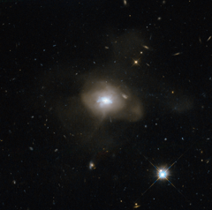

# Preview of potw1148a: "The calm after the galactic storm"
[https://www.spacetelescope.org/images/potw1148a/](https://www.spacetelescope.org/images/potw1148a/)

The NASA/ESA Hubble Space Telescope has caught sight of a soft, diffuse-looking galaxy that is probably the aftermath of a long-ago galactic collision. Two spiral galaxies, each perhaps much like the Milky Way, swirled together for millions of years. In such mergers, the original galaxies are often stretched and pulled apart as they wrap around a common centre of gravity. After a few back-and-forths, this starry tempest settles down into a new, round object. The now subdued celestial body, catalogued as SDSS J162702.56+432833.9, is technically known as an elliptical galaxy. When galaxies collide — a common event in the Universe — a fresh burst of star formation typically takes place as gas clouds mash together. At this point, the galaxy has a blue hue, but the colour does not mean it is cold: it is a result of the intense heat of newly formed blue–white stars. Those stars do not last long, and after a few billion years the reddish hues of aging smaller stars dominate an elliptical galaxy's spectrum. Hubble has helped astronomers learn of this sequence by observing galaxy mergers at all stages of the process. In SDSS J162702.56+432833.9, some ribbons of dust notably obscure parts of the conglomerated galaxy's central, bluish region. Those dust lanes could be remnants of the spiral arms of the recently departed galaxies. This picture was snapped by the Wide Field Camera of Hubble’s Advanced Camera for Surveys. The image was made through a red (F625W) and a blue (F438W) filter. The field of view is approximately 2.4 by 2.4 arcminutes.