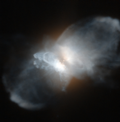

# Preview of potw1149a: "The frosty Leo Nebula"
[https://www.spacetelescope.org/images/potw1149a/](https://www.spacetelescope.org/images/potw1149a/)

Three thousand light-years from Earth lies the strange protoplanetary nebula IRAS 09371+1212, nicknamed the Frosty Leo Nebula. Despite their name, protoplanetary nebulae have nothing to do with planets: they are formed from material shed from their aging central star. The Frosty Leo Nebula has acquired its curious name as it has been found to be rich in water in the form of ice grains, and because it lies in the constellation of Leo. This nebula is particularly noteworthy because it has formed far from the galactic plane, away from interstellar clouds that may block our view. The intricate shape comprises a spherical halo, a disc around the central star, lobes and gigantic loops. This complex structure strongly suggests that the formation processes are complex and it has been suggested that there could be a second star, currently unseen, contributing to the shaping of the nebula. Protoplanetary nebulae like the Frosty Leo Nebula have brief lifespans by astronomical standards and are precursors to the planetary nebula phase, in which radiation from the star will make the nebula’s gas light up brightly. Their rarity makes studying them a priority for astronomers who seek to understand better the evolution of stars. This picture was created from images taken with the High Resolution Channel of Hubble’s Advanced Camera for Surveys, which images a small area of sky (only 26 by 29 arcseconds) in high detail.