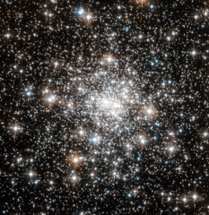

# Preview of potw1150a: "Standing out from the crowd"
[https://www.spacetelescope.org/images/potw1150a/](https://www.spacetelescope.org/images/potw1150a/)

The compact nature of globular clusters is a double-edged sword. On the one hand, having so many stars of a similar age in one bundle gives astronomers insights into the chemical makeup of our galaxy in its early history. But, at the same time, the high density of stars in the cores of globulars also makes it difficult for astronomers to resolve individual stars. The core of NGC 6642, shown here in this Hubble Space Telescope image, is particularly dense, making this globular a difficult observational target for most telescopes. Furthermore, it occupies a very central position in our galaxy, which means that images inadvertently capture many stars that don’t belong to the cluster — these “field stars” just get in the way. However, using Hubble’s powerful Advanced Camera for Surveys (ACS), astronomers can identify and remove such distracting field stars, and resolve the cluster’s dense core in unprecedented detail. Using Hubble’s ACS, astronomers have already made many interesting finds about NGC 6642. For example, many “blue stragglers” (stars which seemingly lag behind in their rate of aging) have been spotted in this globular, and it is known to be lacking in low-mass stars. This picture was created from visible and infrared images taken with the Wide Field Channel of the Advanced Camera for Surveys. The field of view is approximately 1.6 by 1.6 arcminutes.