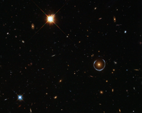

# Preview of potw1151a: "Hubble captures a “lucky” galaxy alignment"
[https://www.spacetelescope.org/images/potw1151a/](https://www.spacetelescope.org/images/potw1151a/)

An interesting galaxy has been circled in this NASA/ESA Hubble Space Telescope image. The galaxy — one of a group of galaxies called Luminous Red Galaxies — has an unusually large mass, containing about ten times the mass of the Milky Way. However, it’s actually the blue horseshoe shape that circumscribes the red galaxy that is the real prize in this image. This blue horseshoe is a distant galaxy that has been magnified and warped into a nearly complete ring by the strong gravitational pull of the massive foreground Luminous Red Galaxy. To see such a so-called Einstein Ring required the fortunate alignment of the foreground and background galaxies, making this object’s nickname “the Cosmic Horseshoe” particularly apt. The Cosmic Horseshoe is one of the best examples of an Einstein Ring. It also gives us a tantalising view of the early Universe: the blue galaxy’s redshift — a measure of how the wavelength of its light has been stretched by the expansion of the cosmos — is approximately 2.4. This means we see it as it was about 3 billion years after the Big Bang. The Universe is now 13.7 billion years old. Astronomers first discovered the Cosmic Horseshoe in 2007 using data from the Sloan Digital Sky Survey. But this Hubble image, taken with the Wide Field Camera 3, offers a much more detailed view of this fascinating object. This picture was created from images taken in visible and infrared light on Hubble’s Wide Field Camera 3. The field of view is approximately 2.6 arcminutes wide.