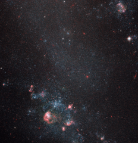

# Preview of potw1152a: "Faint galaxy with popping pink features"
[https://www.spacetelescope.org/images/potw1152a/](https://www.spacetelescope.org/images/potw1152a/)

The NASA/ESA Hubble Space Telescope has imaged a region of space containing the intriguing object IC 2574. Pink bubbles blown by supernova explosions abound in this faint galaxy. The colour of these shells comes from hydrogen gas irradiated by newborn stars. The formation of the stars was triggered by shock waves from earlier supernova detonations that compressed material together. IC 2574 is commonly known as Coddington's Nebula after the American astronomer Edwin Coddington, who discovered it in 1898. Astronomers classify IC 2574 as a dwarf irregular galaxy due to its relatively small size and lack of organisation or structure. These galaxies are thought to resemble some of the earliest that formed in the Universe. Dwarf irregular galaxies thus serve as useful "living fossils" for studying the evolution of more complex galaxy types such as our home, the Milky Way, with its central bar and spiral arms. The expanding shells in IC 2574 are of particular interest to astronomers as they reveal how supernova-driven explosions ignite round after round of star formation.   The constellation containing IC 2574 is Ursa Major (The Great Bear). IC 2574 is located about 12 million light-years away, belonging to the Messier 81 group of galaxies. This group is named after the most prominent galaxy in its midst, the big, bright and accordingly well-studied spiral galaxy Messier 81. This picture was produced with Hubble’s Advanced Camera for Surveys, and covers a field of view of around 3.3 by 3.3 arcminutes.