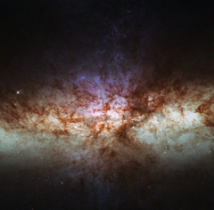

# Preview of potw1201a: "Smoke without fire: a different view of the cigar galaxy"
[https://www.spacetelescope.org/images/potw1201a/](https://www.spacetelescope.org/images/potw1201a/)

This image shows the most detailed view ever of the core of Messier 82 (M 82), also known as the Cigar Galaxy. Rich with dust, young stars and glowing gas, M 82 is both unusually bright and relatively close to Earth. The starburst galaxy is located around 12 million light-years away in the constellation of Ursa Major (The Great Bear). This is not the first time Hubble has imaged the Cigar Galaxy. Previous images (for example heic0604) show a galaxy ablaze with stars. Yet this image looks quite unlike them, and is dominated instead by glowing gas and dust, with the stars almost invisible. Why such a difference? The new image is more detailed than previous Hubble observations – in fact, it is the most detailed image ever made of this galaxy. But the reason it looks so dramatically different is down to the choices astronomers make when designing their observations. Hubble’s cameras do not see in colour: they are sensitive to a broad range of wavelengths which they image only in greyscale. Colour pictures can be constructed by passing the light through different coloured filters and combining the resulting images, but the choice of filters makes a big difference to the end result. Using filters which allow through relatively broad bands of colours, similar to those our eyes see, results in natural-looking colours and bright stars, as starlight shines brightly across the spectrum. Using filters transparent only to the wavelengths emitted by specific chemical elements, as in this image, isolates the light from glowing gas clouds, while blocking out much of the starlight. This explains why the stars appear faint in this image, and why the dust lanes are sharply silhouetted against the brightly glowing gas clouds. The image shows the light emitted by sulphur (shown in red), visible and ultraviolet light from oxygen (shown green and blue, respectively), and light from hydrogen (cyan). The field of view is approximately 2.7 by 2.7 arcminutes.