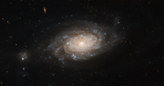

# Preview of potw1202a: "Hubble spots a busy barred spiral"
[https://www.spacetelescope.org/images/potw1202a/](https://www.spacetelescope.org/images/potw1202a/)

This  classic shot of a galaxy in the constellation of Ursa Major was taken  by the NASA/ESA Hubble Space Telescope. NGC 3259 is a bright barred  spiral galaxy located approximately 110 million light-years from Earth. Being  a fully-formed active galaxy, its bright central bulge hosts a  supermassive black hole, whose huge appetite for matter explains the  high luminosity of the galaxy’s core: as it devours its surroundings,  the black hole emits intense radiation across the whole electromagnetic  spectrum, including in visible light. The  beautiful spiral arms of the galaxy are not left out either as they  contain dark lanes of dust and gas, ideal spawning grounds for stars.  These bright, young, hot stars appear in rich clusters in the galaxy’s  arms and are what gives the galaxy its blueish hue. Interestingly,  the galaxy has a small companion (visible to the left of the image), a  much smaller galaxy that may be orbiting NGC 3259. In the background,  numerous distant galaxies can be seen, easily identifiable by their  elliptical shapes. They are visible here mainly in infrared light, which  is shown in red in this image.