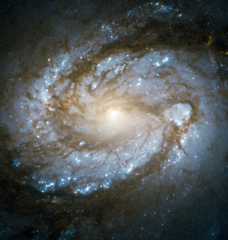

# Preview of potw1203a: "Core of Messier 100 in super high res"
[https://www.spacetelescope.org/images/potw1203a/](https://www.spacetelescope.org/images/potw1203a/)

Messier 100 is a perfect example of a grand design spiral galaxy, a type of galaxy with prominent and very well-defined spiral arms. These dusty structures swirl around the galaxy’s nucleus, and are marked by a flurry of star formation activity that dots Messier 100 with bright blue, high-mass stars. This image from the NASA/ESA Hubble Space Telescope, the most detailed made to date, shows the bright core of the galaxy and the innermost parts of its spiral arms. Messier 100 has an active galactic nucleus — a bright region at the galaxy’s core caused by a supermassive black hole that is actively swallowing material, which radiates brightly as it falls inwards. The galaxy’s spiral arms also host smaller black holes, including the youngest ever observed in our cosmic neighbourhood, the result of a supernova observed in 1979. Messier 100 is located in the direction of the constellation of Coma Berenices, about 50 million light-years distant. The galaxy became famous in the early 1990s with the release of two images of the object taken with Hubble before and after a major repair to the telescope, which illustrated the dramatic improvement in Hubble’s observations. This image, taken with the high resolution channel of Hubble’s Advanced Camera for Surveys demonstrates the continued evolution of Hubble’s capabilities over two decades in orbit. This image, like all high resolution channel images, has a relatively small field of view: only around 25 by 25 arcseconds. Links   Hubble image showing a wider field view, including more of the spiral arms  ESO Very Large Telescope image showing the full galaxy   