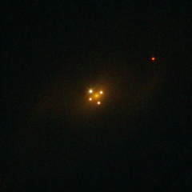

# Preview of potw1204a: "Seeing quadruple"
[https://esahubble.org/images/potw1204a/](https://esahubble.org/images/potw1204a/)

This NASA/ESA Hubble Space Telescope picture may trick you into thinking that the galaxy in it — known as UZC J224030.2+032131 — has not one but five different nuclei. In fact, the core of the galaxy is only the faint and diffuse object seen at the centre of the cross-like structure formed by the other four dots, which are images of a distant quasar located in the background of the galaxy. The picture shows a famous cosmic mirage known as the Einstein Cross, and is a direct visual confirmation of the theory of general relativity. It is one of the best examples of the phenomenon of gravitational lensing — the bending of light by gravity as predicted by Einstein in the early 20th century. In this case, the galaxy’s powerful gravity acts as a lens that bends and amplifies the light from the quasar behind it, producing four images of the distant object. The quasar is seen as it was around 11 billion light-years ago, in the direction of the constellation of Pegasus, while the galaxy that works as a lens is some ten times closer. The alignment between the two objects is remarkable (within 0.05 arcseconds), which is in part why such a special type of gravitational lensing is observed. This image is likely the sharpest image of the Einstein Cross ever made, and was produced by Hubble’s Wide Field and Planetary Camera 2, and has a field of view of 26 by 26 arcseconds.