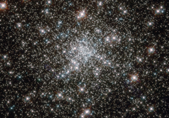

# Preview of potw1205a: "Young stars at home in an ancient cluster"
[https://www.spacetelescope.org/images/potw1205a/](https://www.spacetelescope.org/images/potw1205a/)

Looking like a hoard of gems fit for an emperor’s collection, this deep sky object called NGC 6752 is in fact far more worthy of admiration. It is a globular cluster, and at over 10 billion years old is one the most ancient collections of stars known. It has been blazing for well over twice as long long as our Solar System has existed. NGC 6752 contains a high number of “blue straggler” stars, some of which are visible in this image. These stars display characteristics of stars younger than their neighbours, despite models suggesting that most of the stars within globular clusters should have formed at approximately the same time. Their origin is therefore something of a mystery. Studies of NGC 6752 may shed light on this situation. It appears that a very high number — up to 38% — of the stars within its core region are binary systems. Collisions between stars in this turbulent area could produce the blue stragglers that are so prevalent. Lying 13 000 light-years distant, NGC 6752 is far beyond our reach, yet the clarity of Hubble’s images brings it tantalisingly close.