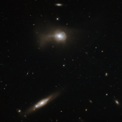

# Preview of potw1206a: "Transforming galaxies"
[https://www.spacetelescope.org/images/potw1206a/](https://www.spacetelescope.org/images/potw1206a/)

Many  of the Universe’s galaxies are like our own, displaying beautiful  spiral arms wrapping around a bright nucleus. Examples in this stunning  image, taken with the Wide Field Camera 3 on the NASA/ESA Hubble Space  Telescope, include the tilted galaxy at the bottom of the frame, shining  behind a Milky Way star, and the small spiral at the top centre. Other  galaxies are even odder in shape. Markarian 779, the galaxy at the top  of this image, has a distorted appearance because it is likely the  product of a recent galactic merger between two spirals. This collision  destroyed the spiral arms of the galaxies and scattered much of their  gas and dust, transforming them into a single peculiar galaxy with a  unique shape. This  galaxy is part of the Markarian catalogue, a database of over 1500  galaxies named after B. E. Markarian, the Armenian astronomer who  studied them in the 1960s. He surveyed the sky for bright objects with  unusually strong emission in the ultraviolet. Ultraviolet  radiation can come from a range of sources, so the Markarian catalogue  is quite diverse. An excess of ultraviolet emissions can be the result  of the nucleus of an “active” galaxy, powered by a supermassive black  hole at its centre. It can also be due to events of intense star  formation, called starbursts, possibly triggered by galactic collisions.  Markarian galaxies are, therefore, often the subject of studies aimed  at understanding active galaxies, starburst activity, and galaxy  interactions and mergers.