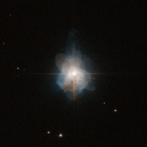

# Preview of potw1207a: "A sheep in Wolf-Rayet’s clothing"
[https://www.spacetelescope.org/images/potw1207a/](https://www.spacetelescope.org/images/potw1207a/)

It’s  well known that the Universe is changeable: even the stars that appear  static and predictable every night are subject to change. This  image from the NASA/ESA Hubble Space Telescope shows planetary nebula  Hen 3-1333. Planetary nebulae are nothing to do with planets — they  actually represent the death throes of mid-sized stars like the Sun. As  they puff out their outer layers, large, irregular globes of glowing gas  expand around them, which appeared planet-like through the small  telescopes that were used by their first discoverers. The  star at the heart of Hen 3-1333 is thought to have a mass of around 60%  that of the Sun, but unlike the Sun, its apparent brightness varies  substantially over time. Astronomers believe this variability is caused  by a disc of dust which lies almost edge-on when viewed from Earth,  which periodically obscures the star. It  is a Wolf–Rayet type star — a late stage in the evolution of Sun-sized  stars. These are named after (and share many observational  characteristics with) Wolf–Rayet stars, which are much larger. Why the  similarity? Both Wolf–Rayet and Wolf–Rayet type stars are hot and bright  because their helium cores are exposed: the former because of the  strong stellar winds characteristic of these stars; the latter because  the outer layers of the stars have been puffed away as the star runs low  on fuel. The  exposed helium core, rich with heavier elements, means that the  surfaces of these stars are far hotter than the Sun, typically 25 000 to  50 000 degrees Celsius (the Sun has a comparatively chilly surface  temperature of just 5500 degrees Celsius). So  while they are dramatically smaller in size, the Wolf–Rayet type stars  such as the one at the core of Hen 3-1333 effectively mimic the  appearance of their much bigger and more energetic namesakes: they are  sheep in Wolf–Rayet clothing. This  visible-light image was taken by the high resolution channel of  Hubble’s Advanced Camera for Surveys. The field of view is approximately  26 by 26 arcseconds.