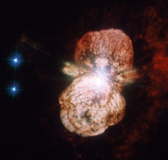

# Preview of potw1208a: "Preview of a forthcoming supernova"
[https://www.spacetelescope.org/images/potw1208a/](https://www.spacetelescope.org/images/potw1208a/)

At the turn of the 19th century, the binary star system Eta Carinae was faint and undistinguished. In the first decades of the century, it became brighter and brighter, until, by April 1843, it was the second brightest star in the sky, outshone only by Sirius (which is almost a thousand times closer to Earth). In the years that followed, it gradually dimmed again and by the 20th century was totally invisible to the naked eye.The star has continued to vary in brightness ever since, and while it is once again visible to the naked eye on a dark night, it has never again come close to its peak of 1843.The larger of the two stars in the Eta Carinae system is a huge and unstable star that is nearing the end of its life, and the event that the 19th century astronomers observed was a stellar near-death experience. Scientists call these outbursts supernova impostor events, because they appear similar to supernovae but stop just short of destroying their star.Although 19th century astronomers did not have telescopes powerful enough to see the 1843 outburst in detail, its effects can be studied today. The huge clouds of matter thrown out a century and a half ago, known as the Homunculus Nebula, have been a regular target for Hubble since its launch in 1990. This image, taken with the Advanced Camera for Surveys High Resolution Channel is the most detailed yet, and shows how the material from the star was not thrown out in a uniform manner, but forms a huge dumbbell shape.Eta Carinae is not only interesting because of its past, but also because of its future. It is one of the closest stars to Earth that is likely to explode in a supernova in the relatively near future (though in astronomical timescales the “near future” could still be a million years away). When it does, expect an impressive view from Earth, far brighter still than its last outburst: SN 2006gy, the brightest supernova ever observed, came from a star of the same type.This image consists of ultraviolet and visible light images from the High Resolution Channel of Hubble’s Advanced Camera for Surveys. The field of view is approximately 30 arcseconds across. Links  Previous images of Eta Carinae from the Hubble Space Telescope:         http://www.spacetelescope.org/images/opo9623a/ http://www.spacetelescope.org/images/opo9409a/ http://www.spacetelescope.org/images/opo9110a/   