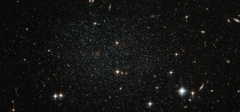

# Preview of potw1209a: "Antlia dwarf galaxy peppers the sky with stars"
[https://www.spacetelescope.org/images/potw1209a/](https://www.spacetelescope.org/images/potw1209a/)

The myriad faint stars that comprise the Antlia Dwarf galaxy are more than four million light-years from Earth, but this NASA/ESA Hubble Space Telescope image offers such clarity that they could be mistaken for much closer stars in our own Milky Way. This very faint and sparsely populated small galaxy was only discovered in 1997. Although small, the Antlia Dwarf is a dynamic site featuring stars at many different stages of evolution, from young to old. The freshest stars are only found in the central regions where there is significant ongoing star formation. Older stars and globular clusters are found in the outer areas. It is not entirely clear whether the Antlia Dwarf is a member our galactic neighbourhood, called the Local Group. It probably lies just beyond the normally accepted outer limits of the group. Although it is fairly isolated, some believe it has interacted with other star groups. Evidence comes from galaxy NGC 3109, close to the Antlia Dwarf (but not visible in this image). Both galaxies feature rifts of stars moving at comparable velocities; a telltale sign that they were gravitationally linked at some point in the past. This picture was created from observations in visible and infrared light taken with the Wide Field Channel of Hubble’s Advanced Camera for Surveys. The field of view is approximately 3.2 by 1.5 arcminutes.