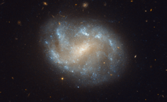

# Preview of potw1210a: "Galaxies' El Dorado"
[https://www.spacetelescope.org/images/potw1210a/](https://www.spacetelescope.org/images/potw1210a/)

The NASA/ESA Hubble Space Telescope has produced this beautiful image of the galaxy NGC 1483. NGC 1483 is a barred spiral galaxy located in the southern constellation of Dorado — the dolphinfish in Spanish. The nebulous galaxy features a bright central bulge and diffuse arms with distinct star-forming regions. In the background, many other distant galaxies can be seen. The constellation Dorado is home to the Dorado Group of galaxies, a loose group comprising an estimated 70 galaxies and located some 62 million light-years away. The Dorado group is much larger than the Local Group that includes the Milky Way (and which contains around 30 galaxies) and approaches the size of a galaxy cluster. Galaxy clusters are the largest groupings of galaxies (and indeed the largest structures of any type) in the Universe to be held together by their gravity.   Barred spiral galaxies are so named because of the prominent bar-shaped structures found in their centre. They form about two thirds of all spiral galaxies, including the Milky Way. Recent studies suggest that bars may be a common stage in the formation of spiral galaxies, and may indicate that a galaxy has reached full maturity.