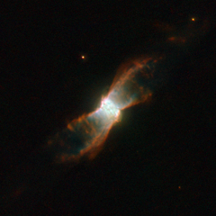

# Preview of potw1211a: "Stellar voyage of a butterfly-like planetary nebula"
[https://www.spacetelescope.org/images/potw1211a/](https://www.spacetelescope.org/images/potw1211a/)

The breathtaking butterfly-like planetary nebula NGC 6881 is visible here in an image taken by the NASA/ESA Hubble Space Telescope. Located in the constellation of Cygnus, it is formed of an inner nebula, estimated to be about one fifth of a light-year across, and symmetrical “wings” that spread out about one light-year from one tip to the other. The symmetry could be due to a binary star at the nebula’s centre. NGC 6881 has a dying star at its core which is about 60% of the mass of the Sun. It is an example of a quadrupolar planetary nebula, made from two pairs of bipolar lobes pointing in different directions, and consisting of four pairs of flat rings. There are also three rings in the centre. A planetary nebula is a cloud of ionised gas, emitting light of various colours. It typically forms when a dying star — a red giant — throws off its outer layers, because of pulsations and strong stellar winds. The star’s exposed hot, luminous core starts emitting ultraviolet radiation, exciting the outer layers of the star, which then become a newly born planetary nebula. At some point, the nebula is bound to dissolve in space, leaving the central star as a white dwarf — the final evolutionary state of stars. The name “planetary” dates back to the 18th century, when such nebulae were first discovered — and when viewed through small optical telescopes, they looked a lot like giant planets. Planetary nebulae usually live for a few tens of thousands of years, a short phase in the lifetime of a star. The image was taken through three filters which isolate the specific wavelength of light emitted by nitrogen (shown in red), hydrogen (shown in green) and oxygen (shown in blue).