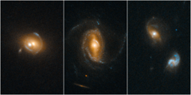

# Preview of potw1212a: "Quasars acting as gravitational lenses"
[https://www.spacetelescope.org/images/potw1212a/](https://www.spacetelescope.org/images/potw1212a/)

Astronomers using the NASA/ESA Hubble Space Telescope have made images of several galaxies containing quasars, which act as gravitational lenses to amplify and distort images of the galaxies aligned behind them. Quasars are among the brightest objects in the Universe, far outshining the total output of their host galaxies. They are powered by supermassive black holes, which pull in surrounding material that then heats up as it falls towards the black hole. The path that the light from even more distant galaxies takes on its journey towards us is bent by the enormous masses at the centre of these galaxies. Gravitational lensing is a subtle effect which requires extremely high resolution observations, something for which Hubble is extremely well suited. To find these rare cases of galaxy–quasar combinations acting as lenses, a team of astronomers led by Frederic Courbin at the Ecole Polytechnique Federale de Lausanne (EPFL, Switzerland) selected 23 000 quasar spectra in the Sloan Digital Sky Survey (SDSS). They looked for the spectral imprint of galaxies at much greater distances that happened to align with foreground galaxies. Once candidates were identified, Hubble’s sharp vision was used to look for the characteristic gravitational arcs and rings that would be produced by gravitational lensing. In Hubble’s images, the quasars are the bright spots visible at the centre of the galaxies, while the lensed images of distant galaxies are visible as fainter arc-shaped forms that surround them. From left to right, the galaxies are: SDSS J0919+2720, with two bluish lensed images clearly visible above and below the galaxy’s centre; SDSS J1005+4016, with one yellowish arc visible to the right of the galaxy’s centre; and SDSS J0827+5224, with two lensed images very faintly visible, one above and to the right, and one below and to the left of the galaxy’s centre. Quasar host galaxies are hard or sometimes even impossible to see because the central quasar far outshines the galaxy. Therefore, it is difficult to estimate the mass of a host galaxy based on the collective brightness of its stars. However, gravitational lensing candidates are invaluable for estimating the mass of a quasar’s host galaxy because the amount of distortion in the lens can be used to estimate a galaxy’s mass.