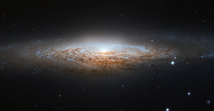

# Preview of potw1213a: "Hubble spies a UFO"
[https://www.spacetelescope.org/images/potw1213a/](https://www.spacetelescope.org/images/potw1213a/)

The NASA/ESA Hubble Space Telescope has spotted a UFO — well, the UFO Galaxy, to be precise. NGC 2683 is a spiral galaxy seen almost edge-on, giving it the shape of a classic science fiction spaceship. This is why the astronomers at the Astronaut Memorial Planetarium and Observatory gave it this attention-grabbing nickname. While a bird’s eye view lets us see the detailed structure of a galaxy (such as this Hubble image of a barred spiral), a side-on view has its own perks. In particular, it gives astronomers a great opportunity to see the delicate dusty lanes of the spiral arms silhouetted against the golden haze of the galaxy’s core. In addition, brilliant clusters of young blue stars shine scattered throughout the disc, mapping the galaxy’s star-forming regions. Perhaps surprisingly, side-on views of galaxies like this one do not prevent astronomers from deducing their structures. Studies of the properties of the light coming from NGC 2683 suggest that this is a barred spiral galaxy, even though the angle we see it at does not let us see this directly. NGC 2683, discovered on 5 February 1788 by the famous astronomer William Herschel, lies in the Northern constellation of Lynx. A constellation named not because of its resemblance to the feline animal, but because it is fairly faint, requiring the “sensitive eyes of a cat” to discern it. And when you manage to get a look at it, you’ll find treasures like this, making it well worth the effort. This image is produced from two adjacent fields observed in visible and infrared light by Hubble’s Advanced Camera for Surveys. A narrow strip which appears slightly blurred and crosses most the image horizontally is a result of a gap between Hubble’s detectors. This strip has been patched using images from observations of the galaxy made by ground-based telescopes, which show significantly less detail. The field of view is approximately 6.5 by 3.3 arcminutes.