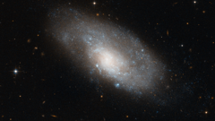

# Preview of potw1214a: "A spiral galaxy in Hydra"
[https://www.spacetelescope.org/images/potw1214a/](https://www.spacetelescope.org/images/potw1214a/)

This image from the NASA/ESA Hubble Space Telescope shows NGC 4980, a spiral galaxy in the southern constellation of Hydra. The shape of NGC 4980 appears slightly deformed, something which is often a sign of recent tidal interactions with another galaxy. In this galaxy’s case, however, this appears not to be the case as there are no other galaxies in its immediate vicinity. The image was produced as part of a research program into the nature of galactic bulges, the bright, dense, elliptical centres of galaxies. Classical bulges are relatively disordered, with stars orbiting the galactic centre in all directions. In contrast, in galaxies with so-called pseudobulges, or disc-type bulges, the movement of the spiral arms is preserved right to the centre of the galaxy. Although the spiral structure is relatively subtle in this image, scientists have shown that NGC 4980 has a disc-type bulge, and its rotating spiral structure extends to the very centre of the galaxy. Galaxies’ bright arms are the location of new star formation in spiral galaxies, and NGC 4980 is no exception. The galaxy’s arms are traced out by blue pockets of extremely hot newborn stars are visible across much of its disc. This sets it apart from the reddish galaxies visible in the background, which are distant elliptical galaxies made up of much older, and hence redder, stars. This image is composed of exposures taken in visible and infrared light by Hubble’s Advanced Camera for Surveys. The image is approximately 3.3 by 1.5 arcminutes in size.